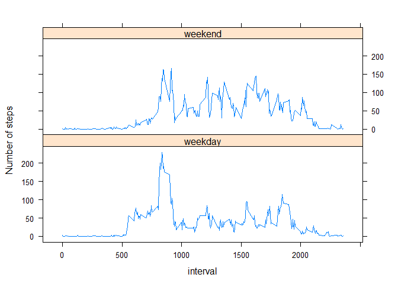

## Loading and preprocessing the data

```r
library(dplyr)
```

```
## 
## Attaching package: 'dplyr'
```

```
## The following objects are masked from 'package:stats':
## 
##     filter, lag
```

```
## The following objects are masked from 'package:base':
## 
##     intersect, setdiff, setequal, union
```

```r
library(lattice)
activity <- read.csv("activity.csv")
bad <- is.na(activity$steps)
activgood <- activity[!bad,]
datesumsteps <- aggregate(activgood["steps"], by=activgood["date"], sum)
hist(datesumsteps$steps, main = "Total Number of Steps Per Day 
\n (missing data ignored)", xlab = "steps")
```

<!-- -->

## What is mean total number of steps taken per day?

```r
print(paste("ignoring missing data, mean steps/day =", mean(datesumsteps$steps)))
```

```
## [1] "ignoring missing data, mean steps/day = 10766.1886792453"
```

```r
print(paste("ignoring missing data, median steps per day =", median(datesumsteps$steps)))
```

```
## [1] "ignoring missing data, median steps per day = 10765"
```

## What is the average daily activity pattern?

```r
intmeansteps <- aggregate(activgood["steps"], by=activgood["interval"], mean)
plot(intmeansteps$interval, intmeansteps$steps, type="l", main = "Mean Steps Per 5-min Interval", xlab="Interval", ylab="Mean # Steps")
```

<!-- -->

```r
maxint <- filter(intmeansteps, steps == max(steps))
print(paste("The interval with the largest mean # steps is =", maxint$interval))
```

```
## [1] "The interval with the largest mean # steps is = 835"
```
Question: Which 5-minute interval, on average across all the days in the dataset, contains the maximum number of steps?

Answer: Interval 835 contains the maximum number of mean steps.

## Imputing missing values

```r
num.NA <- length(activity$interval) - length(activgood$interval)
print(paste("The number of NA's is =", num.NA))
```

```
## [1] "The number of NA's is = 2304"
```

```r
activityImp <- activity
for (i in 1:length(activityImp$interval)){
    if (is.na(activityImp$steps[i])){
        for(j in 1:length(intmeansteps$interval)){
            if (activityImp$interval[i]==intmeansteps$interval[j]){
                activityImp$steps[i] <- intmeansteps$steps[j]
            }
        }
    }
}
Impsumsteps <- aggregate(activityImp["steps"], by=activityImp["date"], sum)
hist(Impsumsteps$steps, main = "Total Number of Steps Per Day \n (missing data imputed from interval means)", xlab = "steps")
```

<!-- -->

```r
print(paste("imputing missing data, mean steps per day =", mean(Impsumsteps$steps)))
```

```
## [1] "imputing missing data, mean steps per day = 10766.1886792453"
```

```r
print(paste("imputing missing data, median steps per day =", median(Impsumsteps$steps)))
```

```
## [1] "imputing missing data, median steps per day = 10766.1886792453"
```
Questions: Do these values differ from the estimates from the first part of the assignment? What is the impact of imputing missing data on the estimates of the total daily number of steps?

Answers: The mean and median total number of steps per day using imputed data for the missing values are the same, and are equal to the mean number of steps from the first part of the assignment: 10766.1886792453 steps. The median number of srteps from the first part of the assignment is slightly different from these: 10765 steps.

## Are there differences in activity patterns between weekdays and weekends?

```r
activityImp$daytype <- ifelse(weekdays(as.Date(activityImp$date)) %in% c("Saturday", "Sunday"), "weekend", "weekday")
activityImp$daytype <- as.factor(activityImp$daytype)
activityImp.wkday <- filter(activityImp, daytype == "weekday")
activityImp.wkend <- filter(activityImp, daytype == "weekend")
wkdaymeansteps <- aggregate(activityImp.wkday["steps"], by=activityImp.wkday["interval"], mean)
wkendmeansteps <- aggregate(activityImp.wkend["steps"], by=activityImp.wkend["interval"], mean)
wkdaymeansteps$daytype = "weekday"
wkendmeansteps$daytype = "weekend"
mrgmeansteps <- rbind(wkdaymeansteps, wkendmeansteps)
xyplot(steps~interval|daytype, data=mrgmeansteps, type="l", ylab = "Number of steps", layout = c(1,2))
```

<!-- -->
